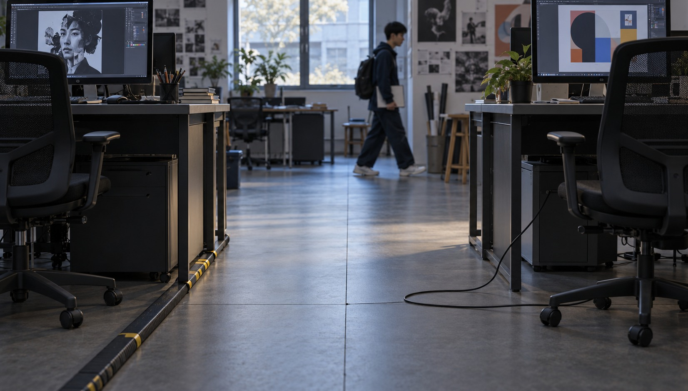
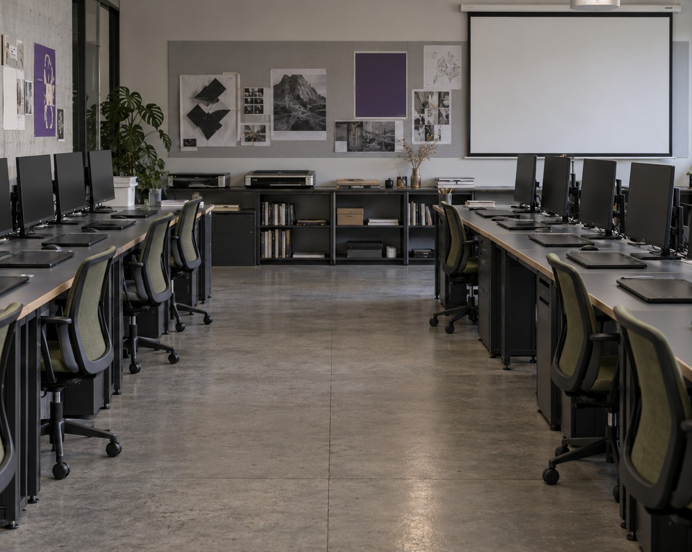
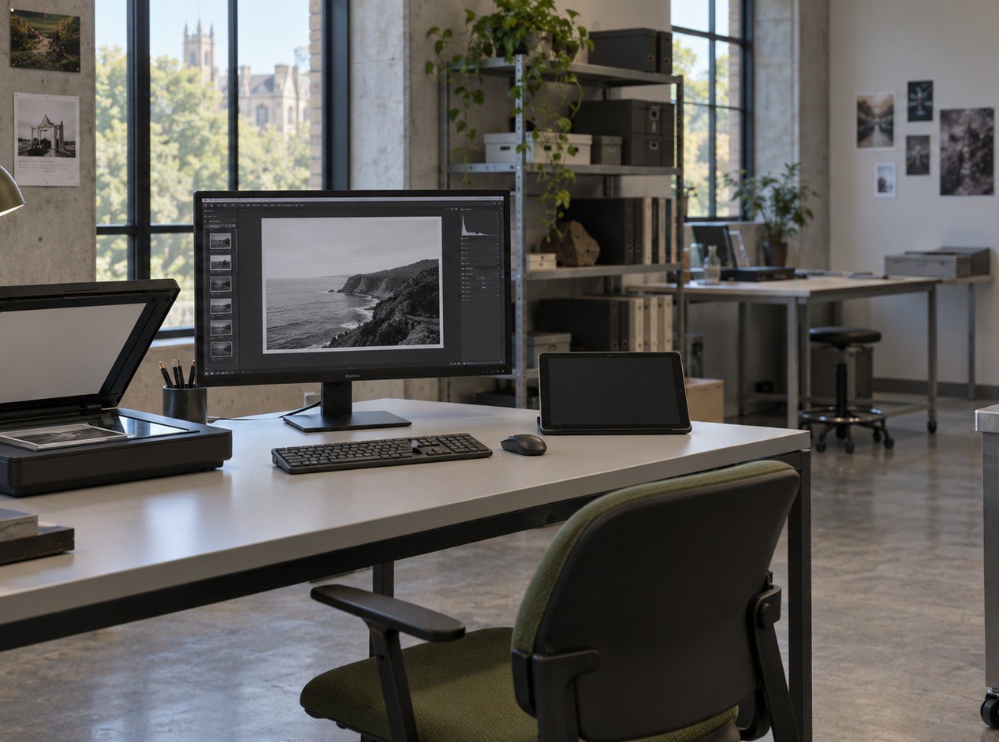
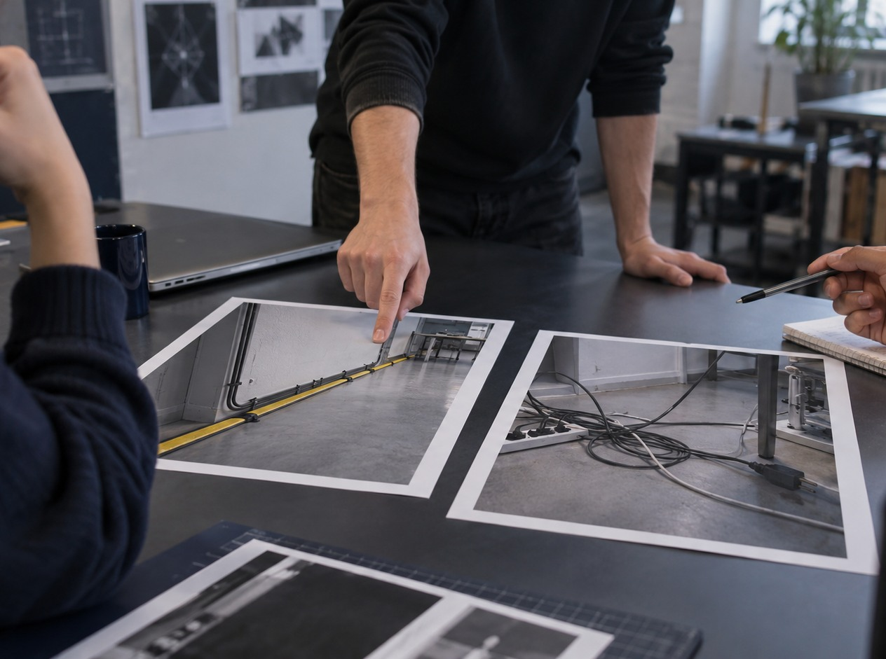

ПМ1 · Сканирование и обработка графической информации

  
Занятие 1

  <h1>Безопасность на рабочем месте при работе с графическим оборудованием</h1>
  
Замечаем риск по наблюдаемому признаку и выбираем действие до начала работы.

люди · идеи · инструменты · изображения · проекты

РО 1.1 · Web Design

01

---
layout: default
---

Зачем дизайнеру техника безопасности

<h1>Риск лучше заметить до того, как он станет проблемой</h1>

<figure><figcaption>Проход пересечён кабелем</figcaption></figure>
<figure><figcaption>Свободный маршрут движения</figcaption></figure>
<figure><figcaption>Организованная рабочая зона</figcaption></figure>
<figure><figcaption>Проверка до начала работы</figcaption></figure>

Что здесь можно увидеть и проверить?

02

---
layout: default
---

Почему это не формальность

ПОЧЕМУ?

<h1>Правило полезно, когда понятно, какой риск оно уменьшает</h1>

<h3>Наблюдение</h3>
Кабель пересекает маршрут движения.

<h3 class="hx-signal">Объяснение</h3>
Его можно зацепить при движении.

Называем условие → риск → действие

03

---
layout: default
---

Что именно наблюдаем

<h1>Четыре зоны быстрой проверки</h1>

1
<h3>Проход</h3>
Свободен ли маршрут движения?

2
<h3>Кабели</h3>
Остаются ли внутри рабочей зоны и закреплены ли?

3
<h3>Питание</h3>
Нет ли видимого повреждения вилок, розеток и проводов?

4
<h3>Жидкости</h3>
Удалены ли они от оборудования и соединений?

Критерий должен быть видимым или проверяемым

04

---
layout: default
---

Показ преподавателя

<h1>Алгоритм безопасного взгляда</h1>

1

Остановиться до начала работы.

2

Осмотреть маршрут движения и рабочую зону.

3

Назвать конкретный наблюдаемый риск.

4

Устранить условие или сообщить преподавателю.

Не ищем «страшную картинку» — ищем проверяемый признак

05

---
layout: default
---

Разбор одного примера

<h1>Кабель и граница рабочего места</h1>

<h3>A · внутри рабочей зоны</h3>
Общий проход свободен.

<h3 class="hx-signal">B · пересекает проход</h3>
Риск связан с положением кабеля.

Что изменилось? Всё остальное в паре должно оставаться одинаковым

06

---
layout: default
---

Граница вывода

<h1>По одному кадру нельзя знать всё</h1>

<h2>Можно сказать</h2>
«Кабель видимо пересекает проход».

<h2>Нельзя доказать кадром</h2>
Что человек обязательно споткнётся или что оборудование обязательно будет повреждено.

Наблюдение ≠ гарантированный исход

07

---
layout: default
---

Работа в парах

<h1>Какая ситуация требует исправления?</h1>

Выберите A или B. Назовите один наблюдаемый признак, риск и конкретное действие. Не используйте ответ «потому что так безопаснее».

Формат: вижу → риск → действие

08

---
layout: default
---

Зачем и почему

<h1>Зачем кабель должен оставаться внутри рабочей зоны?</h1>

<h2>Назовите наблюдение</h2>
Где проходит кабель относительно маршрута движения?

<h2>Объясните следствие</h2>
Что меняется, когда кабель выходит в общий проход?

Причина должна быть связана с тем, что видно

09

---
layout: default
---

Разбор ответов

<h1>От бытовой фразы к профессиональной</h1>

Слабее
<h2>«Там просто бардак»</h2>
Оценка не указывает конкретный риск.

Сильнее
<h2>«В проходе лежит кабель»</h2>
Признак можно показать; действие — убрать кабель из маршрута движения.

Другой человек должен суметь проверить ваш вывод

10

---
layout: default
---

Интерактив · 90 секунд

<h1>Пять наблюдаемых признаков</h1>

<h2>Смотрите на маршрут</h2>
Что пересекает проход? Что выступает в него?

<h2>Смотрите на рабочую зону</h2>
Где питание? Где жидкости? Как расположены кабели и оборудование?

Каждый называет один признак и объясняет «почему»

11

---
layout: default
---

Мини-дебаты

<h1>До начала занятия осталось 30 секунд. Что исправить первым?</h1>

Выберите приоритет не по внешнему виду, а по наблюдаемому риску. Назовите признак → возможное следствие → первое действие.

30 секунд на решение · затем короткая защита

12

---
layout: default
---

Сильный устный вывод

<h1>Факт, риск и действие</h1>

1
<h3>Факт</h3>
Что именно видно?

2
<h3>Место</h3>
Где находится условие?

3
<h3>Риск</h3>
Какое следствие связано с ним?

4
<h3>Действие</h3>
Что изменить до начала работы?

Не «плохо», а конкретно и проверяемо

13

---
layout: default
---

30 секунд перед работой

<h1>Быстрая проверка</h1>

1

<h3>Проход</h3>
Свободен от кабелей, сумок и выдвинутых предметов.

2

<h3>Кабели и питание</h3>
Не пересекают маршрут; видимых повреждений нет.

3

<h3>Жидкости</h3>
Не находятся рядом с оборудованием и соединениями.

4

<h3>Рабочая зона</h3>
Можно начать работу, не перемещая опасно предметы вокруг себя.

Сначала проверка — затем оборудование

14

---
layout: default
---

Итог занятия

<h1>Мы учились видеть условия безопасной работы</h1>

Результат: студент называет наблюдаемый признак, связанный с ним риск и действие, которое нужно выполнить до начала работы.

Дальше: организация рабочего места и эргономика

15

