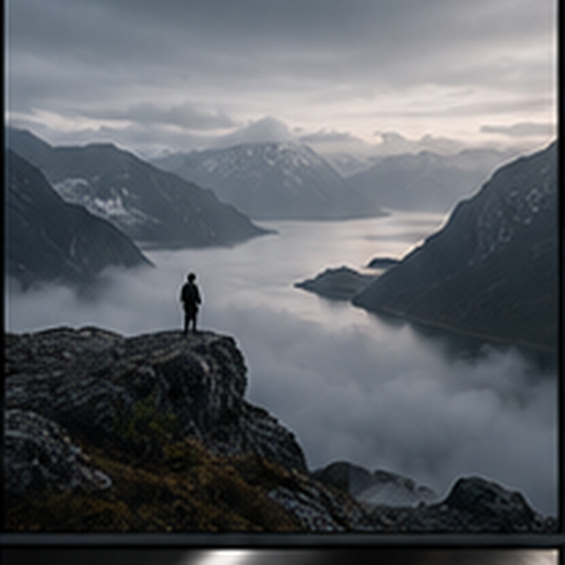

ПМ1 · Сканирование и обработка графической информации

  
Занятие 31

  <h1>Photoshop: cinematic web-hero из исходника</h1>
  
Готовим выразительный первый экран и сохраняем возможность изменить каждое решение.

РО 1.1 · Web Design · 60 минут

01

---
layout: default
---

Результат занятия

<h1>Один исходник превращается в управляемый web-hero</h1>

  
<h3>Brief</h3>
Сообщение, главный объект и место для текста.

  
<h3>Master</h3>
Исходник защищён, структура остаётся редактируемой.

  
<h3>Crop</h3>
Широкий кадр сохраняет смысл и безопасные края.

  
<h3>Tone + color</h3>
Коррекции направляют взгляд и не разрушают детали.

  
<h3>Export</h3>
Отдельный web-файл проверен вне Photoshop.

Наблюдаемый результат: master.psd + hero_export

02

---
layout: default
---

Brief до Photoshop

<h1>Сначала определяем сообщение кадра</h1>

  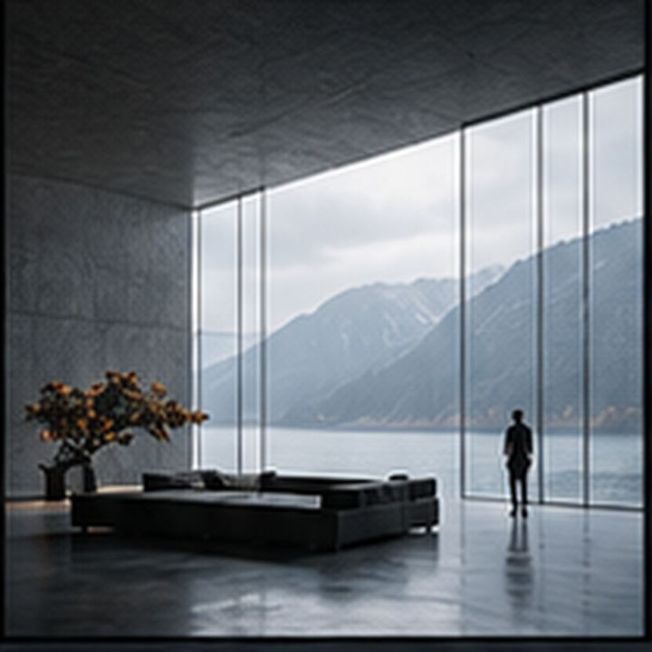
  

    
Красивой фотографии недостаточно: hero работает вместе с заголовком и CTA.

    <ul>
      <li><strong>Главный объект:</strong> что зритель замечает первым?</li>
      <li><strong>Text zone:</strong> где текст не спорит с деталями?</li>
      <li><strong>Ограничение:</strong> что нельзя потерять при широком crop?</li>
    </ul>
  

Критерий появляется до выбора инструмента

03

---
layout: default
---

Production-цепочка

<h1>Правка должна оставаться обратимой</h1>

  
<h3>Original</h3>
Разрешённый исходник хранится отдельно и не перезаписывается.

  
<h3>Working copy</h3>
Эксперимент отделён от первичного файла.

  
<h3>Master.psd</h3>
Smart Object, слои и маски сохраняют логику решения.

  
<h3>Export</h3>
Производная версия подходит интерфейсу, но не заменяет master.

Если правку нельзя отключить и сравнить, файл плохо подготовлен к production

04

---
layout: default
---

Защита исходника

<h1>Smart Object сохраняет пространство для следующего решения</h1>

  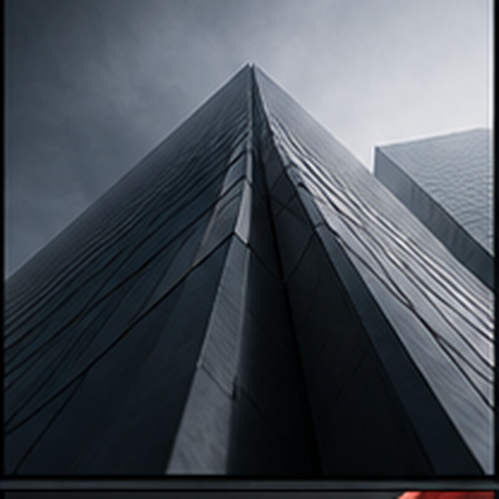
  

    <h2>Проверяем в Layers</h2>
    <ul>
      <li>исходный слой защищён;</li>
      <li>масштабирование не переписывает пиксели;</li>
      <li>коррекции включаются и выключаются;</li>
      <li>экспорт не сохраняется поверх master.psd.</li>
    </ul>
  

Доказательство находится в структуре файла

05

---
layout: default
---

Crop под задачу

<h1>Широкий кадр сохраняет объект и создаёт text zone</h1>

  
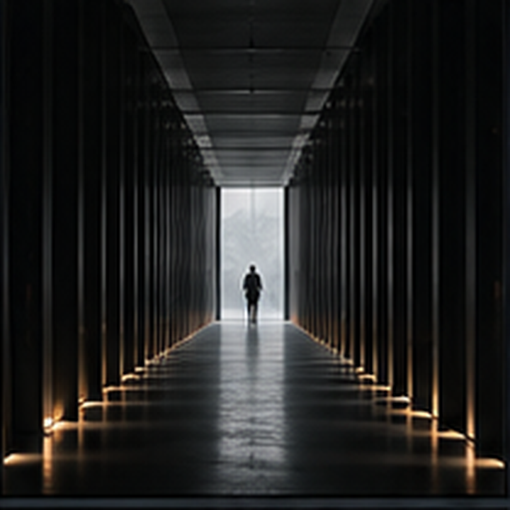<h3>Смысловой центр</h3>
Главный объект остаётся узнаваемым даже в уменьшенном hero.

  
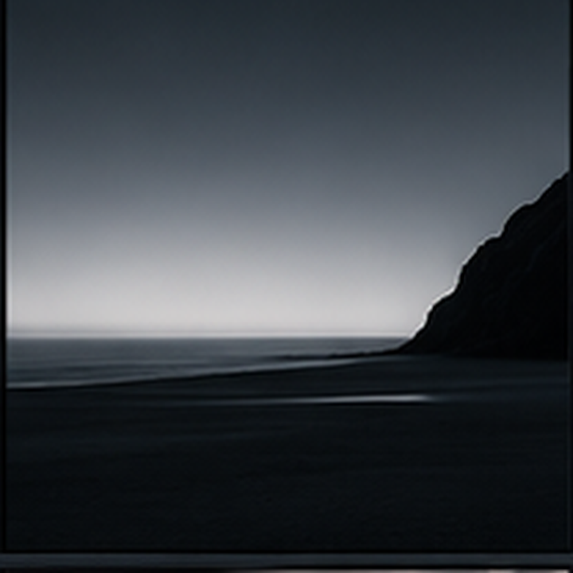<h3>Спокойная зона</h3>
Заголовок размещается там, где фон не разрушает читаемость.

Учебный ориентир: около 1600×700 px, а не универсальный закон

06

---
layout: default
---

Свет и тон

<h1>Curves направляет взгляд, а не добавляет эффект ради эффекта</h1>

  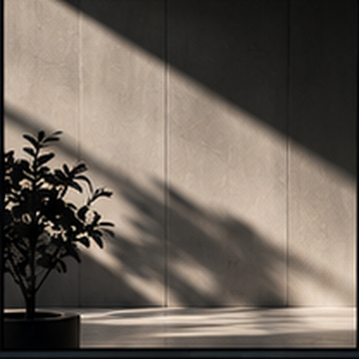
  

    <h2>Before / after</h2>
    
Включите и выключите Adjustment Layer. Сравните:

    <ul>
      <li>где взгляд останавливается первым;</li>
      <li>сохранились ли детали в тенях и светах;</li>
      <li>не стала ли text zone слишком активной.</li>
    </ul>
  

Критерий: ясность сообщения, а не сила контраста

07

---
layout: default
---

Цвет и Layer Mask

<h1>Локальная коррекция отделяет главное от фона</h1>

  
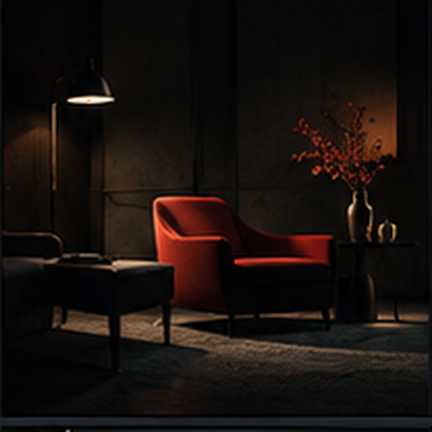<h2 style="margin-top:14px">Adjustment Layer</h2>
Меняет цветовой характер кадра без прямой перезаписи исходника.

  
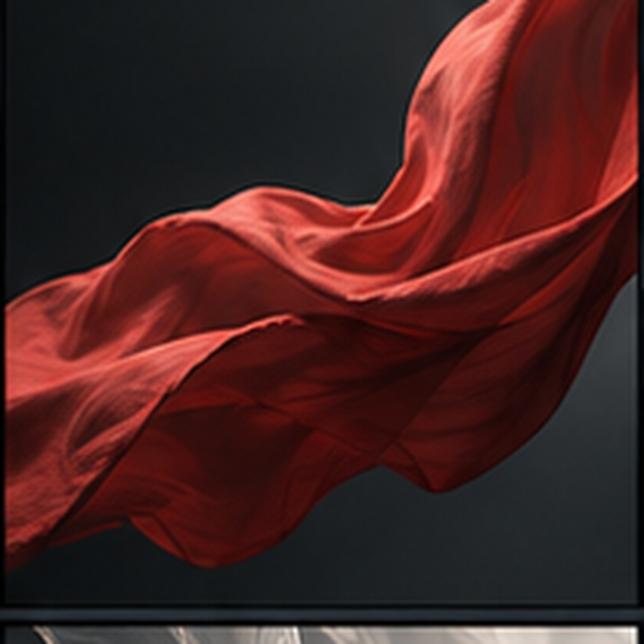<h2 style="margin-top:14px">Layer Mask</h2>
Белое показывает действие, чёрное скрывает, серое ослабляет.

Маску оцениваем в реальном масштабе hero

08

---
layout: default
---

Сдержанность в обработке

<h1>Сильнее не всегда означает убедительнее</h1>

  
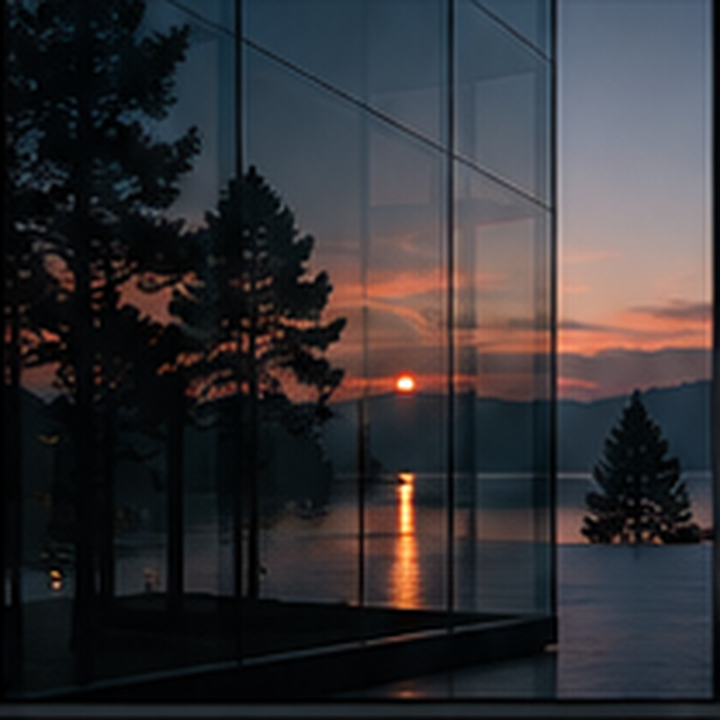<h3>Работающий акцент</h3>
Контраст поддерживает главный объект и оставляет место интерфейсу.

  
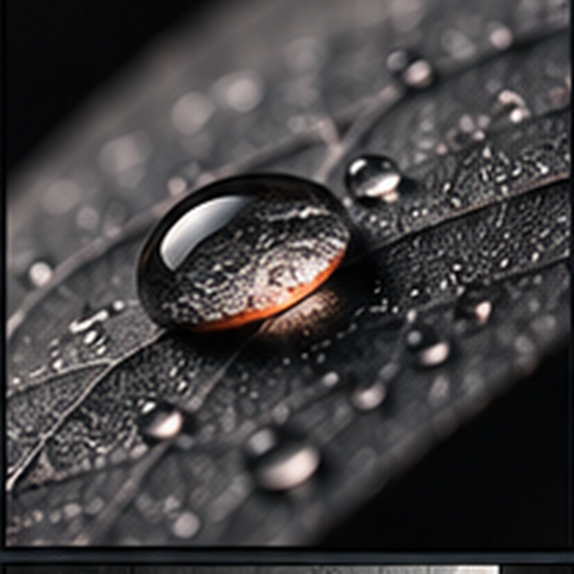<h3>Избыточный эффект</h3>
Детали становятся самостоятельным сюжетом и начинают спорить с текстом.

Сравниваем по одному критерию: читаемость первого экрана

09

---
layout: default
---

Пять вопросов к hero

<h1>Проверяем решение по наблюдаемым признакам</h1>

  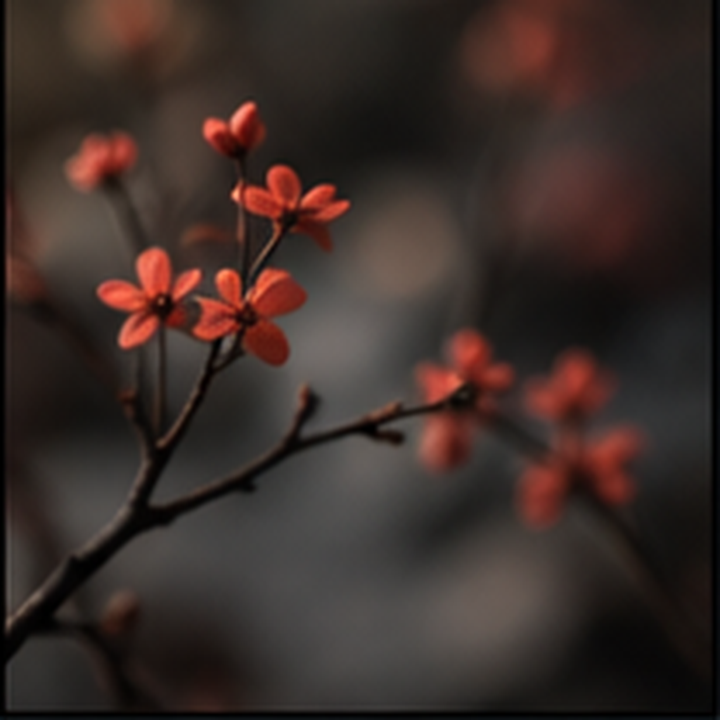
  <ol>
    <li>Что зритель замечает первым?</li>
    <li>Где расположится заголовок и CTA?</li>
    <li>Какая деталь обязательна для смысла?</li>
    <li>Сохранились ли детали после коррекции?</li>
    <li>Можно ли отключить каждую правку?</li>
  </ol>

Ответ подтверждается кадром, слоями и экспортом

10

---
layout: default
---

Показ преподавателя · 0–12 минут

<h1>Один шаг — одна проблема — один проверяемый результат</h1>

  
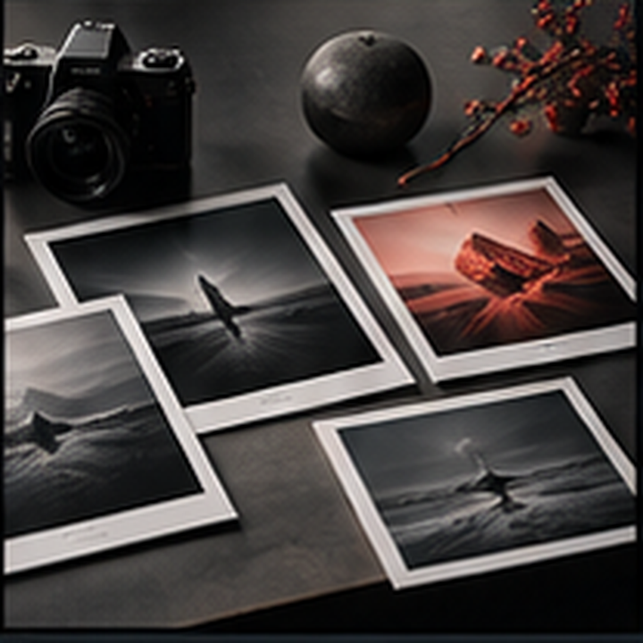<h3>1 · Brief</h3>
Назвать сообщение и ограничение.

  
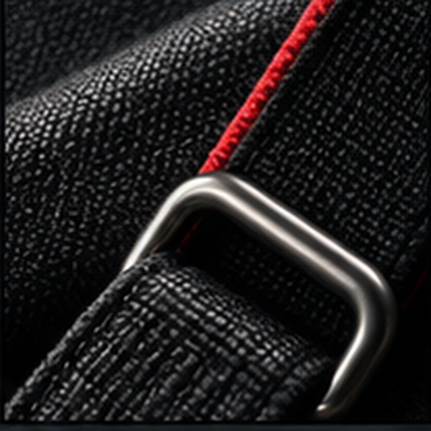<h3>2 · Master</h3>
Защитить исходник и структуру.

  
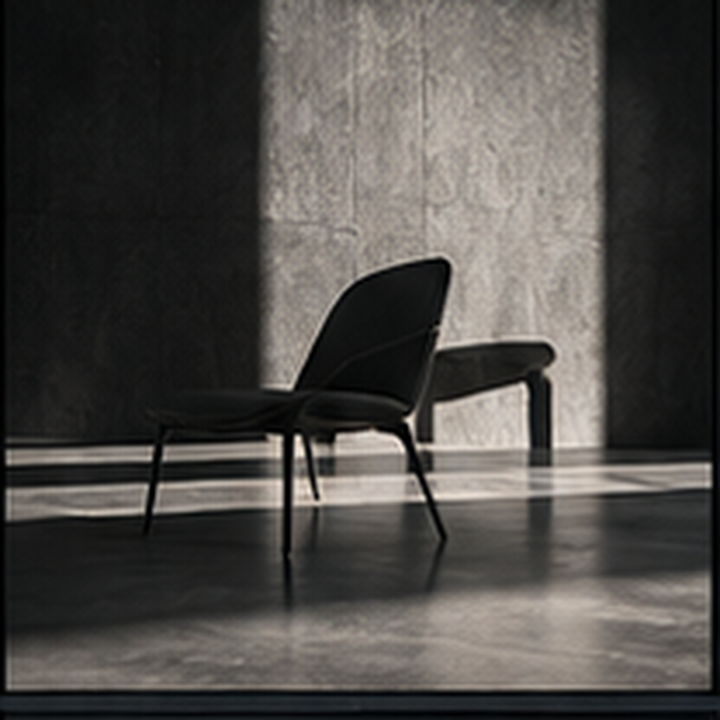<h3>3 · Crop</h3>
Сохранить объект и text zone.

  
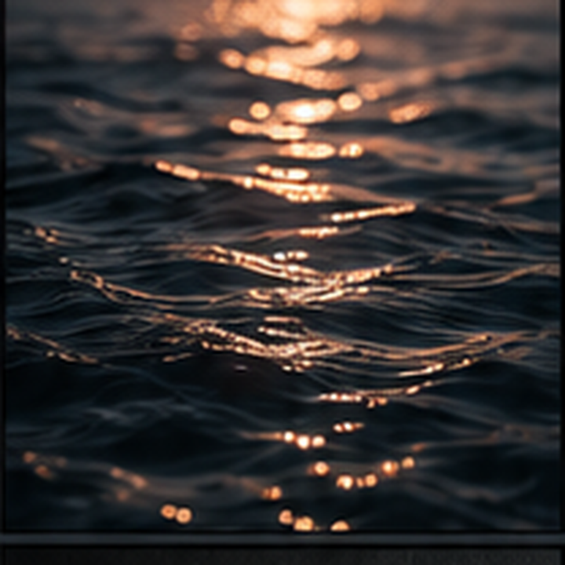<h3>4 · Export</h3>
Открыть web-файл отдельно.

Преподаватель объясняет выбор до передачи первого шага студентам

11

---
layout: default
---

Практика · 12–53 минуты

<h1>От совместного crop к самостоятельному master.psd</h1>

  
<h3>12–25</h3>
Группа определяет сообщение, главный объект и text zone второго исходника.

  
<h3>25–35</h3>
Студент создаёт master.psd и защищает основной слой.

  
<h3>35–48</h3>
Тон, цвет и минимум одна локальная маска.

  
<h3>48–53</h3>
Отдельный экспорт и проверка файла вне Photoshop.

Практическое доказательство важнее быстрого устного ответа

12

---
layout: default
---

Как звучит сильный вывод

<h1>Объяснение связывает условие, действие и результат</h1>

  
<h3>Условие</h3>
Главный объект справа, слева активная фактура.

  
<h3>Действие</h3>
Crop сохранил объект, а маска снизила контраст слева.

  
<h3>Признак</h3>
Заголовок читается, важные детали остались видимыми.

  
<h3>Проверка</h3>
Слои отключаются, export открыт отдельно от master.

«Выглядит лучше» не объясняет решение

13

---
layout: default
---

Проверка результата · 53–60 минут

<h1>Готовность hero подтверждают шесть признаков</h1>

  

1

<h3>Original сохранён</h3>
Исходный файл не перезаписан.

  

2

<h3>Master обратим</h3>
Smart Object, слои и маски доступны.

  

3

<h3>Crop осмыслен</h3>
Главный объект и безопасные края сохранены.

  

4

<h3>Text zone читаема</h3>
Фон не спорит с заголовком и CTA.

  

5

<h3>Коррекция локальна</h3>
Контраст и цвет поддерживают сообщение.

  

6

<h3>Export проверен</h3>
Web-файл открыт и соответствует назначению.

Before/after critique основан на фактах

14

---
layout: default
---

Итог занятия

<h1>Photoshop становится частью production, а не набором фильтров</h1>

  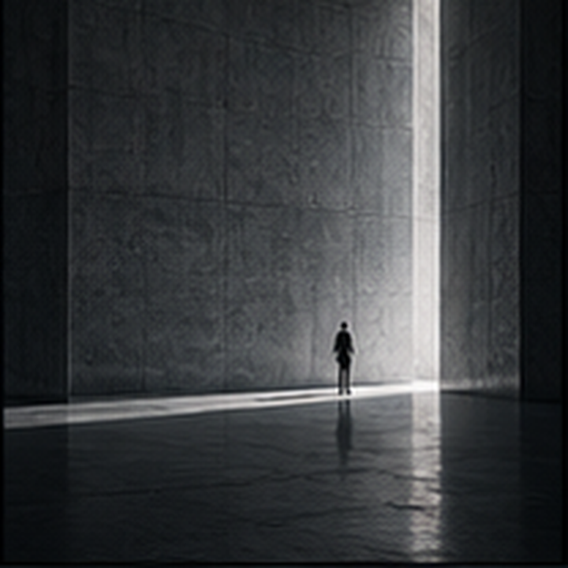
  

    
Сохранил исходник → построил master → выбрал crop → обработал слоями и масками → экспортировал web-версию.

    
<strong>Артефакты занятия:</strong> original, master.psd и hero_export.

  

П031 · Результат объяснён и проверен

15

