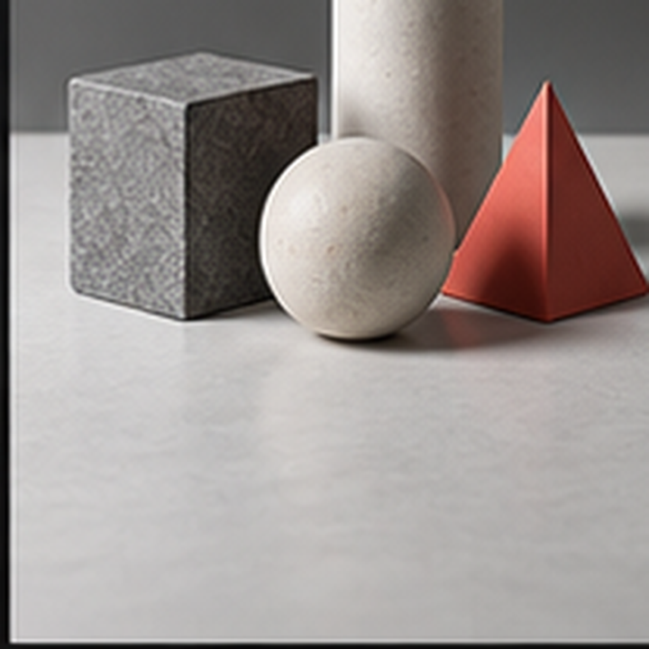

ПМ1 · Сканирование и обработка графической информации

  
Занятие 32

  <h1>Photoshop: чистый объект для карточки</h1>
  
Отделяем объект неразрушающе, проверяем край и готовим PNG для интерфейса.

РО 1.1 · Web Design · 60 минут

01

---
layout: default
---

Результат занятия

<h1>Объект выдерживает смену фона и работает в web-card</h1>

  
<h3>Selection</h3>
Автовыделение создаёт стартовую область, а не готовый край.

  
<h3>Layer Mask</h3>
Фон скрыт обратимо, исходные пиксели остаются доступными.

  
<h3>Edge test</h3>
Светлая и тёмная подложки показывают ореол и потерянные детали.

  
<h3>PNG alpha</h3>
Экспорт открыт отдельно и проверен внутри карточки.

Артефакты: редактируемый PSD + PNG с прозрачностью

02

---
layout: default
---

Контекст использования

<h1>Качество края проверяет интерфейс, а не шахматный фон Photoshop</h1>

  
  

    
В карточке объект уменьшается, оказывается рядом с текстом и получает новый фон.

    <ul>
      <li>силуэт остаётся узнаваемым;</li>
      <li>важные детали не исчезают;</li>
      <li>край не выдаёт старую подложку;</li>
      <li>масштаб поддерживает иерархию карточки.</li>
    </ul>
  

Production-готовность подтверждает конечный контекст

03

---
layout: default
---

Анализ до выделения

<h1>Тип границы определяет способ обработки</h1>

  
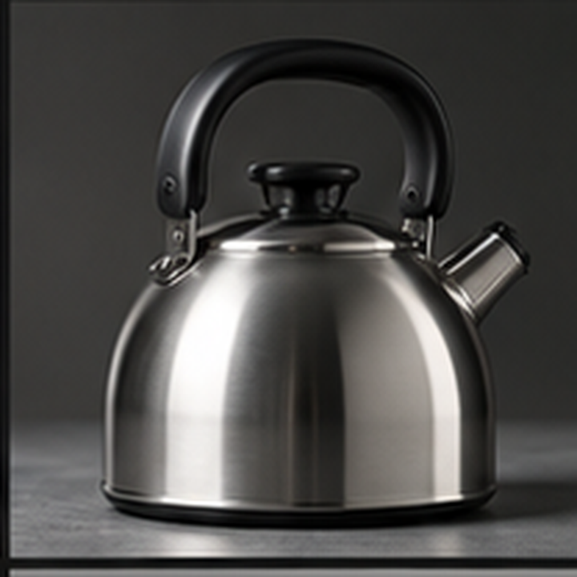<h3>Hard edge</h3>
Металл, пластик и упаковка требуют точного силуэта без размытой каймы.

  
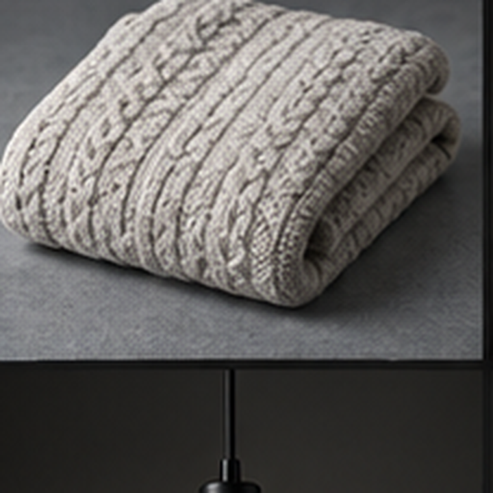<h3>Soft edge</h3>
Ткань и волокна требуют естественного перехода и сохранения частичных деталей.

Одинаковая кисть не подходит разным материалам

04

---
layout: default
---

Первичное выделение

<h1>Select Subject экономит время, но край оценивает дизайнер</h1>

  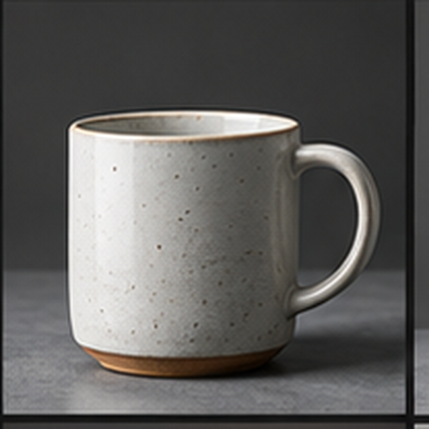
  

    <h2>Проверка после автодействия</h2>
    <ul>
      <li>сохранился ли просвет внутри ручки;</li>
      <li>не захвачен ли похожий по цвету фон;</li>
      <li>остались ли мелкие части силуэта;</li>
      <li>где алгоритм требует ручной правки.</li>
    </ul>
  

Автоматизация создаёт черновик, ответственность остаётся у автора

05

---
layout: default
---

Неразрушающая работа

<h1>Layer Mask отделяет решение «видно» от исходных пикселей</h1>

  
<h3>Белое</h3>
Показывает содержимое слоя.

  
<h3>Чёрное</h3>
Скрывает участок без удаления пикселей.

  
<h3>Серое</h3>
Создаёт частичную прозрачность мягкого края.

  
<h3>Проверка</h3>
Маску можно отключить и вернуть потерянную деталь кистью.

Ластик усложняет исправление, маска сохраняет обратимость

06

---
layout: default
---

Тест двух подложек

<h1>Контрастный фон показывает то, что скрывал похожий</h1>

  
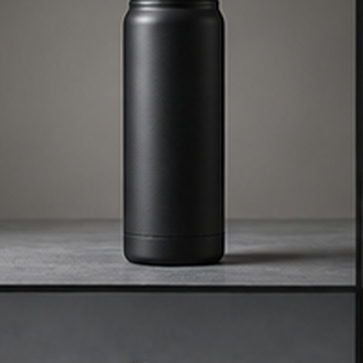<h3>Светлая подложка</h3>
Выявляет тёмные остатки фона и грязь по контуру.

  
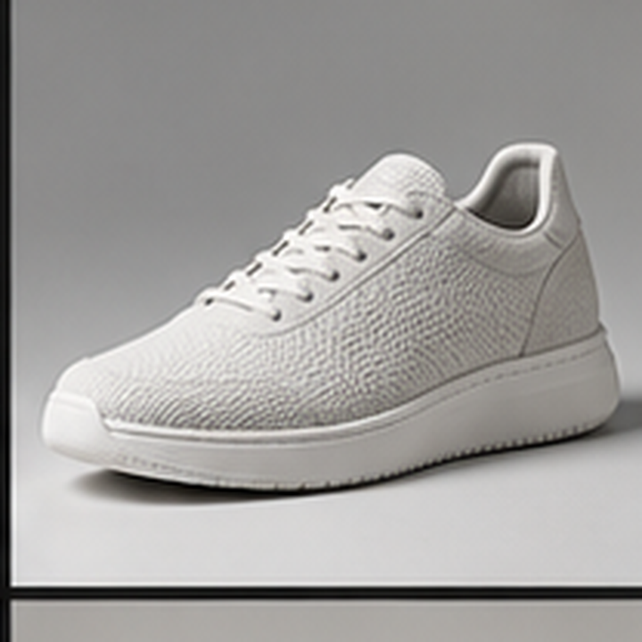<h3>Тёмная подложка</h3>
Показывает светлый halo и слишком жёстко срезанные детали.

Ассет ненадёжен, если чисто выглядит только на одном фоне

07

---
layout: default
---

Масштаб проверки

<h1>100% показывает технику, размер карточки показывает результат</h1>

  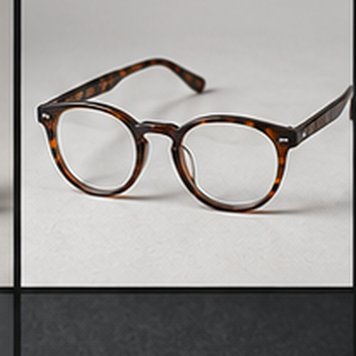
  

    <h2>Два просмотра одной маски</h2>
    
<strong>100%:</strong> ореол, потерянные пиксели, ступенчатый или чрезмерно мягкий край.

    
<strong>Web-card:</strong> узнаваемость силуэта, визуальный вес и отсутствие заметной грязи.

    
Микроретушь имеет смысл, когда исправляет наблюдаемую проблему.

  

Конечный масштаб ограничивает бесконечную пиксельную правку

08

---
layout: default
---

Контактная тень

<h1>Тень объясняет опору и направление света</h1>

  
<h3>Direction</h3>
Направление тени согласовано со светом на объекте.

  
<h3>Contact</h3>
Самая тёмная зона находится у точки опоры.

  
<h3>Blur</h3>
Мягкость увеличивается по мере удаления от объекта.

  
<h3>Opacity</h3>
Тень ощущается, но не становится главным эффектом карточки.

Если тень видна раньше объекта, её сила мешает задаче

09

---
layout: default
---

PNG с alpha

<h1>Экспорт проверяется как самостоятельный файл</h1>

  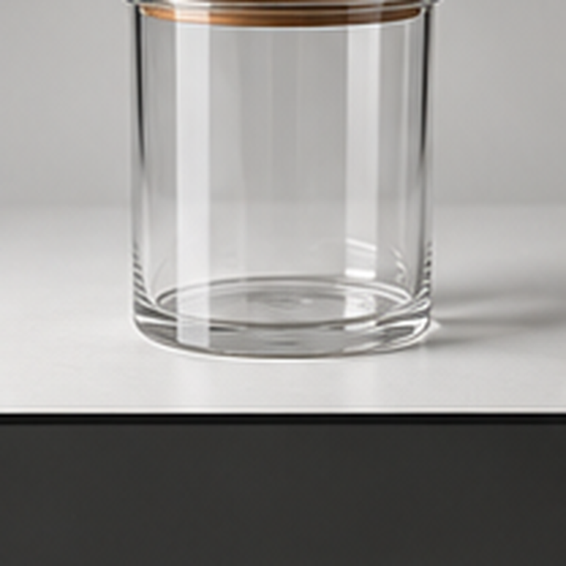
  

    <ul>
      <li>PNG открыт отдельно от master.psd;</li>
      <li>в файл не встроена подложка;</li>
      <li>полупрозрачные участки сохранились;</li>
      <li>на новом фоне не появился ореол;</li>
      <li>размер подходит интерфейсу.</li>
    </ul>
  

Шахматный фон Photoshop не доказывает качество конечного файла

10

---
layout: default
---

Показ преподавателя · 0–12 минут

<h1>Вся цепочка видна в одном рабочем файле</h1>

  
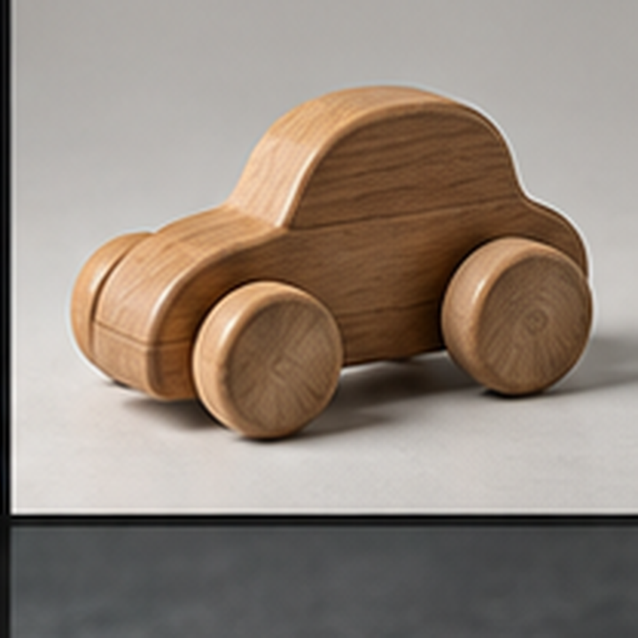<h3>1 · Анализ</h3>
Назвать hard и soft edge, сохранить важные детали.

  
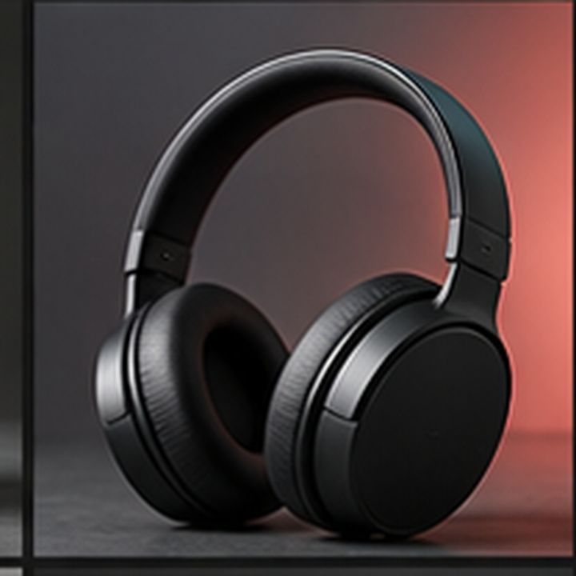<h3>2 · Mask</h3>
Выделить объект и превратить область в Layer Mask.

  
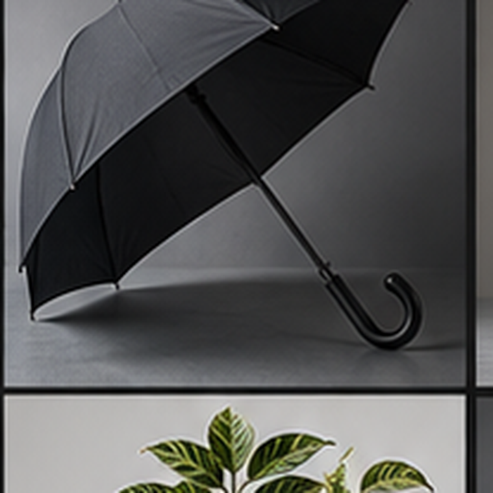<h3>3 · Test</h3>
Проверить светлую и тёмную подложки.

  
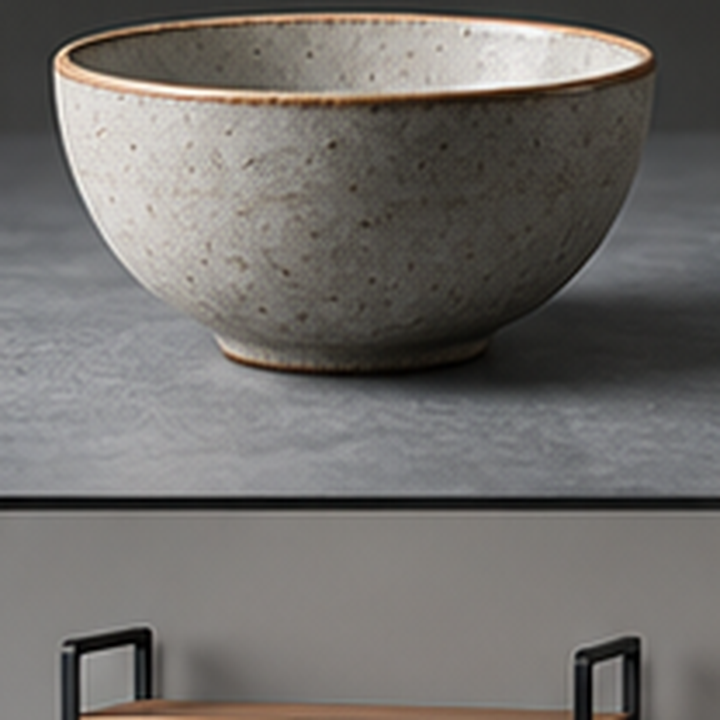<h3>4 · Card</h3>
Добавить тихую тень и открыть экспорт отдельно.

Преподаватель объясняет критерий каждого действия

11

---
layout: default
---

Практика · 12–53 минуты

<h1>От совместной маски к собственному PNG</h1>

  
<h3>12–25</h3>
Группа создаёт маску второго объекта и находит две ошибки края.

  
<h3>25–38</h3>
Студент готовит свой объект и сохраняет редактируемый PSD.

  
<h3>38–48</h3>
Проверяет две подложки, уточняет край и добавляет контактную тень.

  
<h3>48–53</h3>
Экспортирует PNG и проверяет его внутри простой карточки.

Практическое доказательство находится в слоях и конечном файле

12

---
layout: default
---

Диагностические вопросы

<h1>Ответ опирается на конкретный участок изображения</h1>

  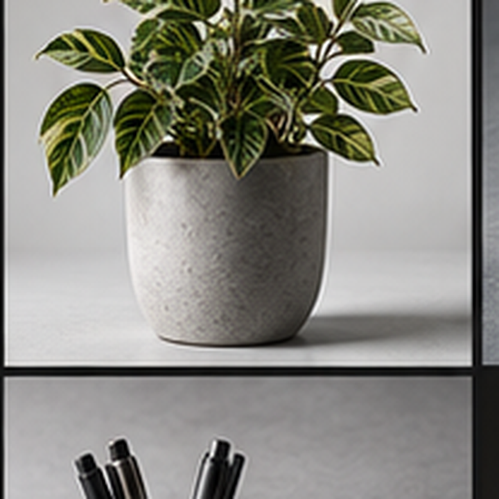
  <ol>
    <li>Где здесь сложный край и почему?</li>
    <li>Какую ошибку может сделать Select Subject?</li>
    <li>На какой подложке сильнее проявится halo?</li>
    <li>Что Layer Mask позволяет исправить позже?</li>
    <li>Как доказать, что PNG содержит alpha?</li>
    <li>Что изменится после помещения объекта в карточку?</li>
  </ol>

Устный ответ подтверждается наблюдаемым признаком

13

---
layout: default
---

Edge critique · 53–60 минут

<h1>Готовность объекта подтверждают восемь признаков</h1>

  

1

<h3>Исходник сохранён</h3>
PSD создан отдельно.

  

2

<h3>Фон скрыт маской</h3>
Пиксели не уничтожены.

  

3

<h3>Силуэт узнаваем</h3>
Важные детали на месте.

  

4

<h3>Два фона проверены</h3>
Ореол не скрывается подложкой.

  

5

<h3>Край соответствует материалу</h3>
Hard и soft edge обработаны по-разному.

  

6

<h3>Тень поддерживает опору</h3>
Свет и мягкость согласованы.

  

7

<h3>PNG сохраняет alpha</h3>
Экспорт открыт отдельно.

  

8

<h3>Card test пройден</h3>
Масштаб и отступы работают.

Формула разбора: факт → объяснение → следующее изменение

14

---
layout: default
---

Итог занятия

<h1>Готовый объект сохраняет силуэт, обратимость и прозрачность</h1>

  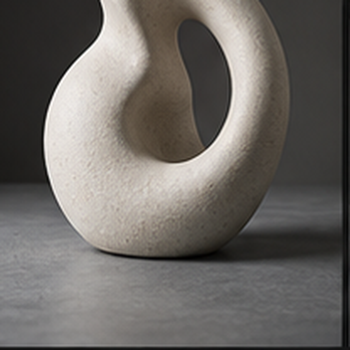
  

    
Выделил → создал маску → проверил два фона → уточнил край → добавил тихую тень → экспортировал PNG → проверил карточку.

    
<strong>Следующее занятие:</strong> согласование цвета серии изображений.

  

П032 · Результат объяснён и проверен

15

